### Student-Teacher Feature Pyramid Matching for Unsupervised Anomaly Detection implementation (unofficial)
Unofficial pytorch implementation of  
Student-Teacher Feature Pyramid Matching for Unsupervised Anomaly Detection (STPM)  
\- Guodong Wang, Shumin Han, Errui Ding, Di Huang  (2021)  
https://arxiv.org/abs/2103.04257v2  

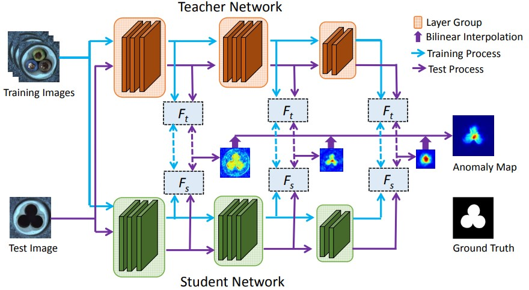

update(21/06/22) :
I changed entire code to lightning version. previous code is in legacy directory.

### Usage 
~~~
# python 3.6, torch==1.8.1, torchvision==0.9.1
pip install -r requirements.txt
python train.py --phase train or test --dataset_path ...\mvtec_anomaly_detection --category bottle --project_path path\to\save\results
~~~

### MVTecAD AUC-ROC score (mean of n trials)
| Category | Paper (pixel-level) | This code (pixel-level) | Paper (image-level) | This code (image-level) |
| :-----: | :-: | :-: | :-: | :-: |
| carpet | 0.988 | 0.991(1) | - | 0.989(1) |
| grid | 0.990 | 0.992(1) | - | 1.000(1) |
| leather | 0.993 | 0.988(1) | - | 0.999(1) |
| tile | 0.974 | 0.968(1) | - | 0.955(1) |
| wood | 0.972 | 0.964(1)| - | 0.992(1) |
| bottle | 0.988 | 0.986(1)| - | 1.000(1) |
| cable | 0.955 | 0.952(1) | - | 0.923(1) |
| capsule | 0.983 | 0.984(1) | - | 0.880(1) |
| hazelnut | 0.985 | 0.988(1) | - | 1.000(1) |
| metal nut | 0.976 | 0.973(1) | - | 1.000(1) |
| pill | 0.978 | 0.969(1) | - | 0.938(1) |
| screw | 0.983 | 0.985(1) | - | 0.882(1) |
| toothbrush | 0.989 | 0.988(1) | - | 0.878(1) |
| transistor | 0.825 | 0.820(1)| - | 0.937(1) |
| zipper | 0.985 | 0.986(1) | - | 0.936(1) |
| mean | 0.970 | 0.969(1) | 0.955 | 0.954(1) |

### Localization results   

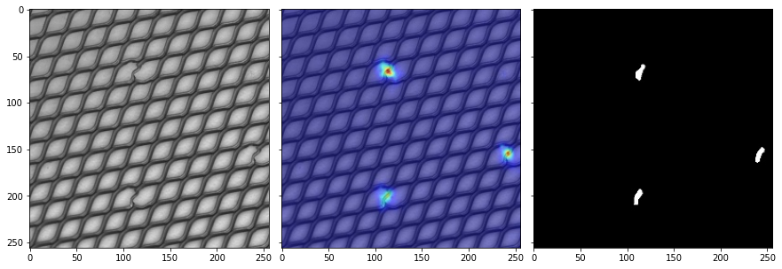
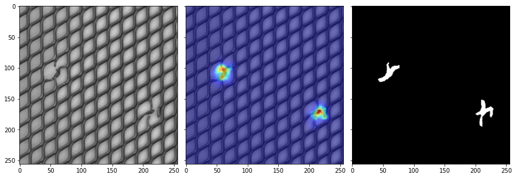

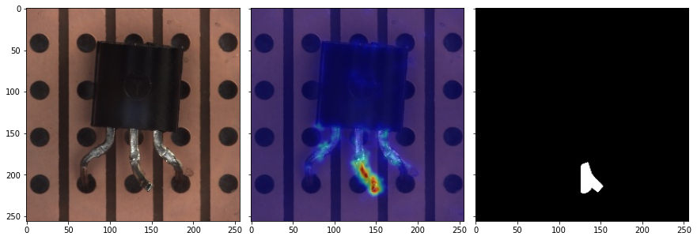

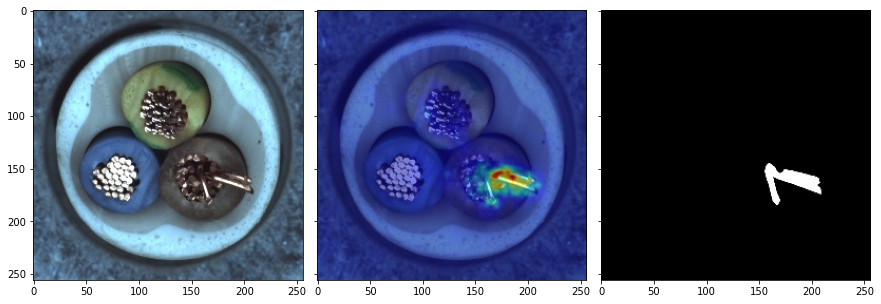
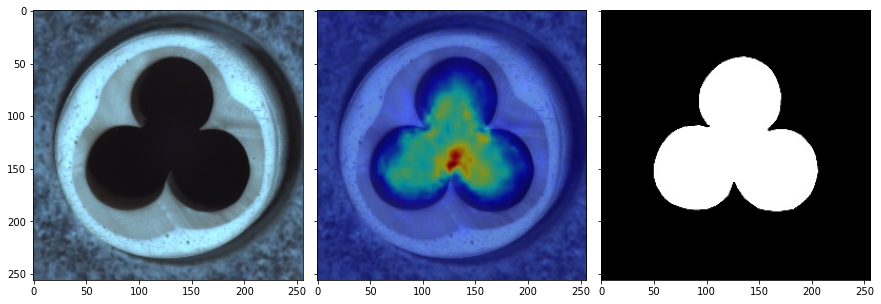

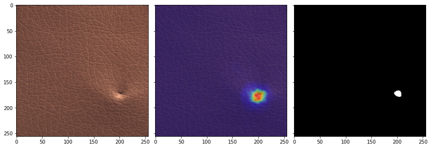

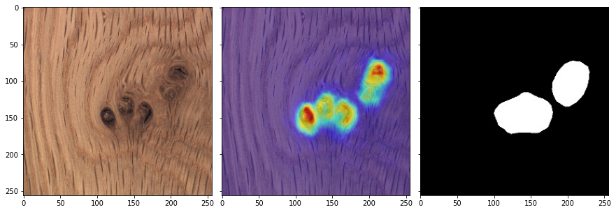

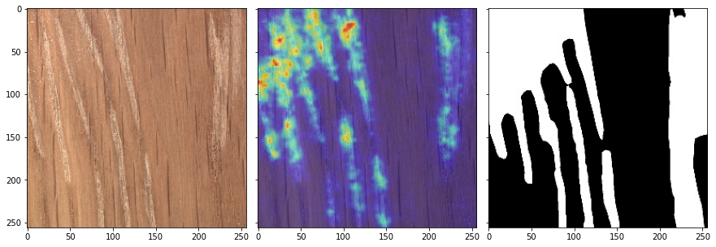

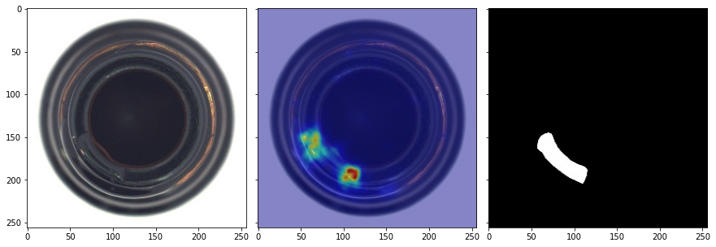
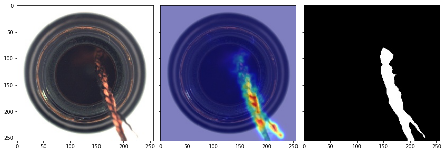

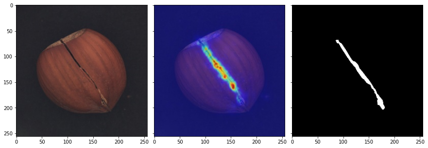
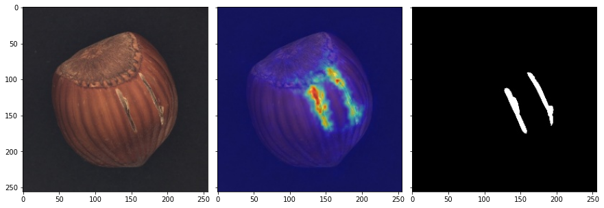
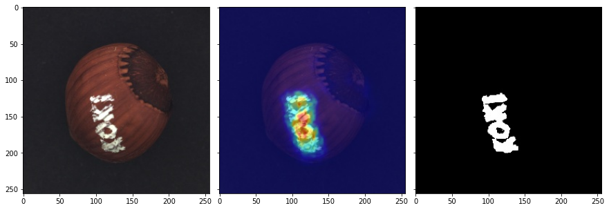

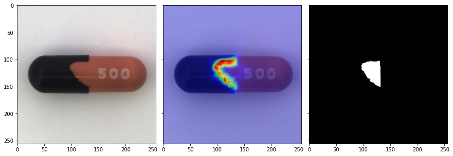
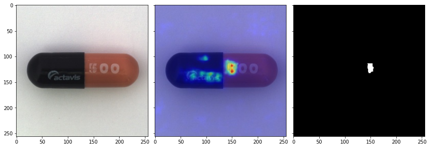

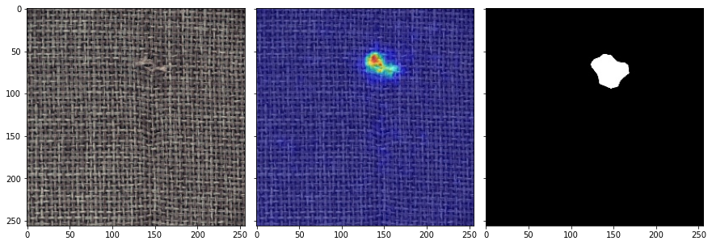
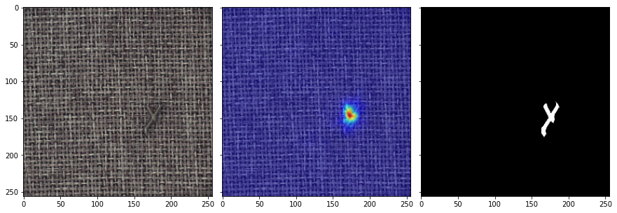
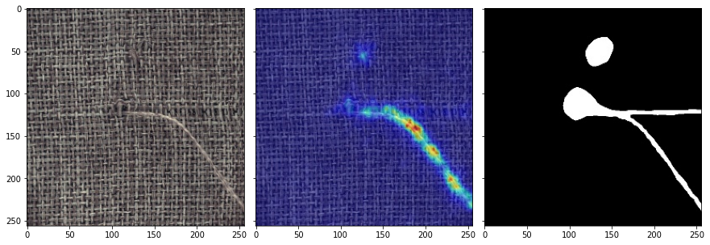